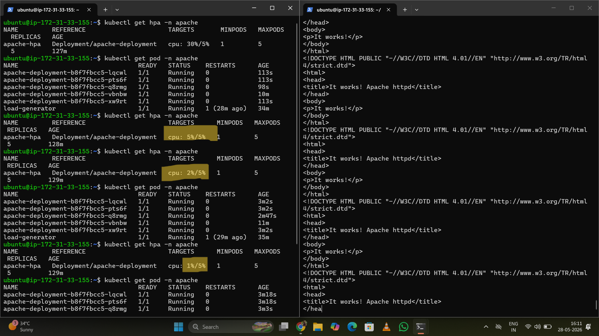
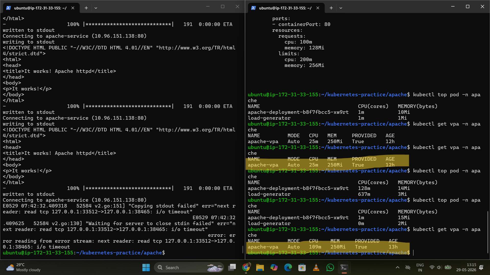

# Apache on Kubernetes

This example demonstrates how to deploy an Apache HTTP Server on Kubernetes with autoscaling and RBAC configuration.

## Features

- Apache Deployment
- ClusterIP Service
- Horizontal Pod Autoscaler (HPA)
- Vertical Pod Autoscaler (VPA)
- Namespace Isolation
- Service Account
- RBAC (Role & RoleBinding)

---

## Files

| File | Description |
|------|-------------|
| deployment.yml | Deploys Apache web server |
| service.yml | Exposes the Apache application |
| namespace.yml | Creates a dedicated namespace |
| serviceAccount.yml | Creates Service Account |
| role.yml | Defines RBAC permissions |
| rolebinding.yml | Attaches Role to Service Account |
| hpa.yml | Horizontal Pod Autoscaler |
| vpa.yml | Vertical Pod Autoscaler |

---

## Architecture

Namespace
   │
ServiceAccount
   │
Role
   │
RoleBinding
   │
Deployment
   │
Service
   │
HPA
   │
VPA

---

## Deploy

Create Namespace

```bash
kubectl apply -f namespace.yml
```

Deploy Apache

```bash
kubectl apply -f deployment.yml
```

Create Service

```bash
kubectl apply -f service.yml
```

Apply RBAC

```bash
kubectl apply -f serviceAccount.yml
kubectl apply -f role.yml
kubectl apply -f rolebinding.yml
```

Enable Autoscaling

```bash
kubectl apply -f hpa.yml
kubectl apply -f vpa.yml
```
---

## Screenshots

### Horizontal Pod Autoscaler



---

### Vertical Pod Autoscaler



---

## Verify

```bash
kubectl get all -n apache
```

Check HPA

```bash
kubectl get hpa -n apache
```

Check VPA

```bash
kubectl get vpa -n apache
```

---

## Learning Outcomes

- Kubernetes Deployment
- Service
- Namespace
- RBAC
- Service Accounts
- Horizontal Pod Autoscaling
- Vertical Pod Autoscaling
