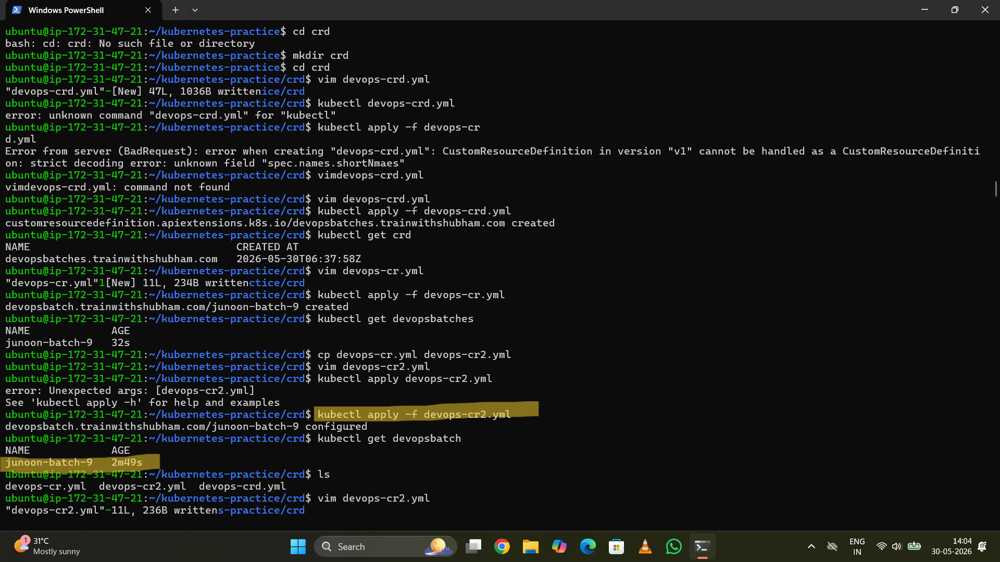

# Custom Resource Definitions (CRDs)

This module demonstrates how to extend the Kubernetes API using **Custom Resource Definitions (CRDs)**. CRDs allow you to define your own custom resources and manage them just like built-in Kubernetes objects.

---

## 📚 Concepts Covered

- Custom Resource Definitions (CRDs)
- Custom Resources (CRs)
- Kubernetes API Extension
- Declarative Resource Management

---

## 📂 Files

| File | Description |
|------|-------------|
| devops-crd.yaml | Defines the Custom Resource Definition |
| devops-cr.yaml | Creates the first Custom Resource |
| devops-cr2.yaml | Creates another instance of the Custom Resource |

---

## 🏗 Architecture

```text
Custom Resource Definition (CRD)
              │
              ▼
     Kubernetes API Server
              │
              ▼
    Custom Resource (CR)
              │
              ▼
kubectl get <custom-resource>
```

---

## 🚀 Deploy

Create the Custom Resource Definition

```bash
kubectl apply -f devops-crd.yaml
```

Create Custom Resources

```bash
kubectl apply -f devops-cr.yaml
kubectl apply -f devops-cr2.yaml
```

---

## ✅ Verify

List Custom Resource Definitions

```bash
kubectl get crd
```

Describe the CRD

```bash
kubectl describe crd
```

View Custom Resources

```bash
kubectl get <resource-name>
```

> Replace `<resource-name>` with the plural name defined in your CRD (for example, `devopsapps`).

---

## 📸 Screenshot



---

## 🎯 Learning Outcomes

After completing this module, you will understand:

- What a Custom Resource Definition (CRD) is
- How to extend the Kubernetes API
- How to create and manage Custom Resources
- How Kubernetes stores and exposes custom objects